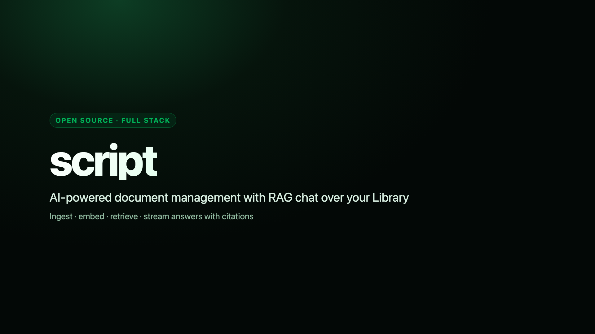

# script

AI-powered document management: ingest documents from local upload, cloud providers, or URL, then
chat with an AI layer that has RAG-based context over your Library.

This is a production application being made **fully functional** — not a presentational demo.
The UI already has a premium, consistent design; the work from here is making it real end to end
without regressing that quality. This entire application — backend, AI integration, and the wiring
between them and the existing frontend — is being built by AI agents. `AGENTS.md` is the contract
that governs how.

## Project introduction

A short overview of what **script** is, how the monorepo fits together, the ingest → embed → RAG
chat flow, and how to run it locally (`pnpm deps:up` + `pnpm dev:app`).

[](docs/assets/script-intro.mp4)

**[Play / download the intro video](./docs/assets/script-intro.mp4)** (~36s, 1080p) — covers product
scope, architecture (`client` / `server` / `shared`), quickstart commands, data flow, and stack.

<details>
<summary>Slide outline</summary>

1. Title — AI document management + RAG chat  
2. Product — Library, ingestion, chat, multi-tenant workspaces  
3. Monorepo — client · server · packages/shared  
4. Quickstart — `pnpm install` → env → `deps:up` → `dev:app`  
5. Data flow — upload → worker → embeddings → chat retrieval  
6. Stack & next docs — `AGENTS.md`, `ENV.md`, self-host vs managed  

Source frames: [`docs/assets/intro-frames/`](./docs/assets/intro-frames/).

</details>

## Docs index

Read in this order if you're new to the repo:

| Doc                                                            | What it's for                                                                      |
| -------------------------------------------------------------- | ---------------------------------------------------------------------------------- |
| [`AGENTS.md`](./AGENTS.md)                                     | The engineering constitution — rules, tech baseline, skills, workflow. Start here. |
| [`projectdef.md`](./projectdef.md)                             | Product spec: what the app does, what the backend must provide.                    |
| [`understanding.md`](./understanding.md)                       | Frontend UI/design-system conventions (Align-UI, Huge Icons, tokens).              |
| [`TODO.md`](./TODO.md)                                         | Live task ledger — what's done, in progress, next.                                 |
| [`ENV.md`](./ENV.md)                                           | Every environment variable: what exists, what's missing.                           |
| [`docs/storage.md`](./docs/storage.md)                         | File storage strategy — managed default + self-hosted (Garage) option.             |
| [`CONTEXT.md`](./CONTEXT.md)                                   | Domain glossary (ubiquitous language).                                             |
| [`docs/pgvector.md`](./docs/pgvector.md)                       | pgvector extension + SQL-managed HNSW/partial indexes.                             |
| [`docs/embeddings-backfill.md`](./docs/embeddings-backfill.md) | Backfill job interface when embedding model changes.                               |
| `docs/adr/`                                                    | Architecture decision records for hard-to-reverse calls.                           |

## Layout

```
client/            React 18 + Vite (SWC) + TypeScript frontend
server/            Fastify + TypeScript backend, Prisma + Neon Postgres
packages/shared/   @script/shared — Zod schemas and shared types
```

Root-level scripts build `shared` first, then run client/server via pnpm workspaces.

## Quickstart

```bash
pnpm install

cp client/.env.example client/.env
cp server/.env.example server/.env
# fill in server/.env: Neon DATABASE_URL/DIRECT_URL (or Compose Postgres), storage credentials,
# VOYAGE_API_KEY, ANTHROPIC_API_KEY — see ENV.md and docs/local-infra.md.

pnpm deps:up      # Redis + Postgres(pgvector) + Garage in Docker (REDIS_URL=redis://127.0.0.1:6379)
pnpm deps:redis   # ensure Redis is up and answers PONG
pnpm dev          # client + API on the host (uses Compose Redis; ALLOW_INLINE_INGESTION=false)
pnpm dev:app      # client + API + BullMQ worker on the host
pnpm stack:up     # optional: build/run API+worker in Docker too (--profile app)
pnpm build && pnpm test && pnpm test:coverage && pnpm lint && pnpm typecheck
pnpm format
# Unit coverage thresholds (≥90% lines on pure modules): see docs/testing.md
```

Server health: `GET http://localhost:4000/health` (liveness),
`GET http://localhost:4000/health/ready` (database + Redis PING + storage).
Chat/ingestion return `503 CONFIGURATION_ERROR` until Voyage and Anthropic keys are set.
After adding Voyage, backfill any older documents via `POST /jobs/embeddings/backfill`.

## Stack

TypeScript everywhere · React 18 + Vite (SWC) · Fastify · Neon Postgres + Prisma + pgvector ·
Voyage AI embeddings · Zod (`@script/shared`) · Pino · Anthropic Claude for AI/RAG · BullMQ/Redis ·
Resend email · pnpm workspaces · Vitest · Prettier + ESLint · TanStack Query.

Full rationale and the rules for extending any of this: `AGENTS.md`.

## Self-hosting

Self-hostable dependencies run via Docker Compose by default: **Redis** (BullMQ), **Postgres +
pgvector**, and **Garage** (S3-compatible object store — `docs/storage.md`). Neon + UploadThing
remain supported managed defaults. Full guide: [`docs/local-infra.md`](./docs/local-infra.md).

## Deploy topology

- **Dependencies:** `pnpm deps:up` / `docker compose up -d` (Redis, Postgres, Garage).
- **API + worker on host:** `pnpm dev:app` with `REDIS_URL=redis://127.0.0.1:6379`.
- **API + worker in Docker:** `pnpm stack:up` (`docker compose --profile app up -d --build`).
- **Web:** static Vite build (`client/dist`) on any static host (e.g. Vercel with `client/vercel.json`
  SPA rewrites) with `VITE_API_URL` pointing at the API origin and `VITE_AUTH_GUARD=true`.
- Run `prisma migrate deploy` on release using `DIRECT_URL`.
