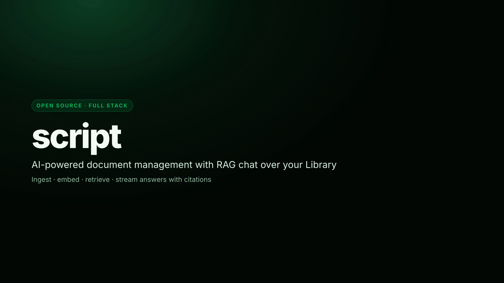

# script

**The company brain.** Ingest the company’s truth. Ask anything. Get cited answers matched to your
clearance.

**script** is a production application: a workspace-scoped **company brain** that starts as a
document memory + RAG chat layer (Library → embed → ask) and grows toward calls, messaging apps,
work systems, and markdown-authored workflows. See [`projectdef.md`](./projectdef.md) for vision vs
shipped scope, and the marketing landing for the same story in product language.

**Where we are** — the capability scorecard ([`projectdef.md`](./projectdef.md) §2, owner's
definition in [`product_path.txt`](./product_path.txt)):

|     | Capability                                | Status                                                  |
| --- | ----------------------------------------- | ------------------------------------------------------- |
| C1  | Document brain (Library + cited RAG chat) | **Shipped**                                             |
| C2  | Agent tools / environment awareness       | **Partial** — runtime shipped, Library + web tools only |
| C3  | Calls & meeting summaries                 | Not started                                             |
| C4  | Bot surface — **Slack in v1** (ADR 0009)  | Not started                                             |
| C5  | Channel context as memory                 | Not started                                             |
| C6  | Notion / Jira / GitHub work context       | Not started                                             |
| C7  | Markdown-authored workflows               | Not started                                             |

**v1 ships with Slack as the only connector app** — Teams next, WhatsApp after
([ADR 0009](./docs/adr/0009-slack-first-messaging-connector.md)). Self-hosting the full product
(beyond the infrastructure already covered in [`docs/local-infra.md`](./docs/local-infra.md)) is an
open design space, kept deliberately possible rather than scheduled.

This is **fully functional** software for the document brain — not a presentational demo. The UI
has a premium, consistent design; keep that quality as we extend the brain. Backend, AI, and
frontend wiring are built by AI agents under the contract in `AGENTS.md`.

## Project introduction

Overview of what **script** is, monorepo layout, ingest → embed → RAG chat, and local run
(`pnpm deps:up` + `pnpm dev:app`).

[](docs/assets/script-intro.mp4)

**[Play / download the intro video](./docs/assets/script-intro.mp4)** (~62s, 1080p, with narration) —
built with [Hyperframes](https://hyperframes.heygen.com) + Kokoro TTS (see `.agents/skills/video`).

<details>
<summary>What’s covered</summary>

1. What script is (company brain · Library + RAG chat)
2. Product capabilities (shipped document brain)
3. Monorepo layout (`client` / `server` / `shared`)
4. Ingest + retrieval data flow
5. Local quickstart commands
6. Stack and where to read next

Source composition: [`docs/assets/intro/`](./docs/assets/intro/) — re-render with:

```bash
# requires: node >= 22, ffmpeg, `npx hyperframes`, kokoro-onnx for TTS
cd docs/assets/intro
npx hyperframes render . -o ../script-intro.mp4 -q high
```

</details>

## Docs index

Read in this order if you're new to the repo:

| Doc                                                            | What it's for                                                                         |
| -------------------------------------------------------------- | ------------------------------------------------------------------------------------- |
| [`AGENTS.md`](./AGENTS.md)                                     | Engineering constitution — rules, tech baseline, skills, workflow. Start here.        |
| [`product_path.txt`](./product_path.txt)                       | The owner's definition of the destination — the source `projectdef.md` §2 answers to. |
| [`projectdef.md`](./projectdef.md)                             | Product vision (company brain), C1–C7 scorecard, shipped slice, backend requirements. |
| [`pipeline.md`](./pipeline.md)                                 | Idea ledger: product C1–C7 bets + org-ready commercial order before items hit TODO.   |
| [`docs/agent-tools.md`](./docs/agent-tools.md)                 | The shipped tool runtime, how to add a tool, and the platform gaps to fix first.      |
| [`docs/connectors.md`](./docs/connectors.md)                   | **Roadmap spec** — messaging bots, channel context, work systems, calls.              |
| [`docs/workflows.md`](./docs/workflows.md)                     | **Roadmap spec** — markdown-authored, run-tracked guided processes.                   |
| [`docs/pitch-ready.md`](./docs/pitch-ready.md)                 | Pitch checklist G1–G16 (packaging, security pack, pilot kit, legal, …).               |
| [`understanding.md`](./understanding.md)                       | Frontend UI/design-system conventions (Align-UI, Huge Icons, tokens).                 |
| [`TODO.md`](./TODO.md)                                         | Live task ledger — what's done, in progress, next.                                    |
| [`ENV.md`](./ENV.md)                                           | Every environment variable: what exists, what's missing.                              |
| [`docs/storage.md`](./docs/storage.md)                         | File storage strategy — managed default + self-hosted (Garage) option.                |
| [`CONTEXT.md`](./CONTEXT.md)                                   | Domain glossary (ubiquitous language).                                                |
| [`docs/pgvector.md`](./docs/pgvector.md)                       | pgvector extension + SQL-managed HNSW/partial indexes.                                |
| [`docs/embeddings-backfill.md`](./docs/embeddings-backfill.md) | Backfill job interface when embedding model changes.                                  |
| `docs/adr/`                                                    | Architecture decision records for hard-to-reverse calls (0001–0009).                  |

## Layout

```
client/            React 18 + Vite (SWC) + TypeScript frontend
server/            Fastify + TypeScript backend, Prisma + Neon Postgres
packages/shared/   @script/shared — Zod schemas and shared types
```

Root-level scripts build `shared` first, then run client/server via pnpm workspaces.

## Quickstart

```bash
pnpm install

cp client/.env.example client/.env
cp server/.env.example server/.env
# fill in server/.env: Neon DATABASE_URL/DIRECT_URL (or Compose Postgres), storage credentials,
# VOYAGE_API_KEY, ANTHROPIC_API_KEY — see ENV.md and docs/local-infra.md.

pnpm deps:up      # Redis + Postgres(pgvector) + Garage in Docker (REDIS_URL=redis://127.0.0.1:6379)
pnpm deps:redis   # ensure Redis is up and answers PONG
pnpm dev          # client + API on the host (uses Compose Redis; ALLOW_INLINE_INGESTION=false)
pnpm dev:app      # client + API + BullMQ worker on the host
pnpm stack:up     # optional: build/run API+worker in Docker too (--profile app)
pnpm build && pnpm test && pnpm test:coverage && pnpm lint && pnpm typecheck
pnpm format
# Unit coverage thresholds (≥90% lines on pure modules): see docs/testing.md
```

Server health: `GET http://localhost:4000/health` (liveness),
`GET http://localhost:4000/health/ready` (database + Redis PING + storage).
Chat/ingestion return `503 CONFIGURATION_ERROR` until Voyage and Anthropic keys are set.
After adding Voyage, backfill any older documents via `POST /jobs/embeddings/backfill`.

## Stack

TypeScript everywhere · React 18 + Vite (SWC) · Fastify · Neon Postgres + Prisma + pgvector ·
Voyage AI embeddings · Zod (`@script/shared`) · Pino · Anthropic Claude for AI/RAG · BullMQ/Redis ·
Resend email · pnpm workspaces · Vitest · Prettier + ESLint · TanStack Query.

Full rationale and the rules for extending any of this: `AGENTS.md`.

## Self-hosting

Self-hostable dependencies run via Docker Compose by default: **Redis** (BullMQ), **Postgres +
pgvector**, and **Garage** (S3-compatible object store — `docs/storage.md`). Neon + UploadThing
remain supported managed defaults. Full guide: [`docs/local-infra.md`](./docs/local-infra.md).

## Deploy topology

- **Dependencies:** `pnpm deps:up` / `docker compose up -d` (Redis, Postgres, Garage).
- **API + worker on host:** `pnpm dev:app` with `REDIS_URL=redis://127.0.0.1:6379`.
- **API + worker in Docker:** `pnpm stack:up` (`docker compose --profile app up -d --build`).
- **Web:** static Vite build (`client/dist`) on any static host (e.g. Vercel with `client/vercel.json`
  SPA rewrites) with `VITE_API_URL` pointing at the API origin and `VITE_AUTH_GUARD=true`.
- Run `prisma migrate deploy` on release using `DIRECT_URL`.
